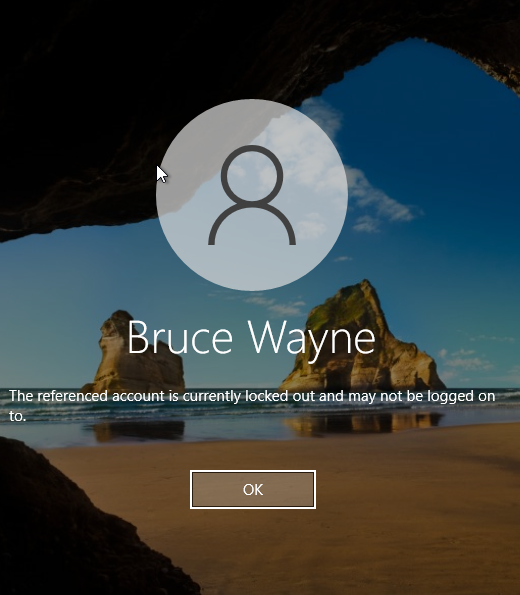
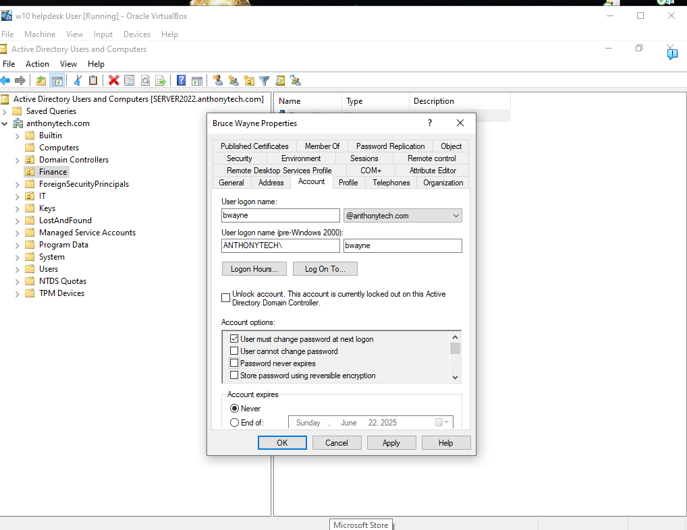
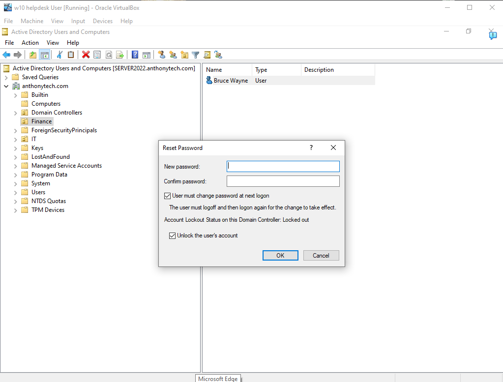
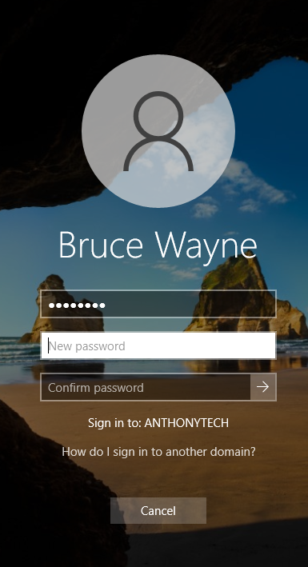
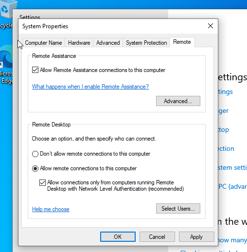
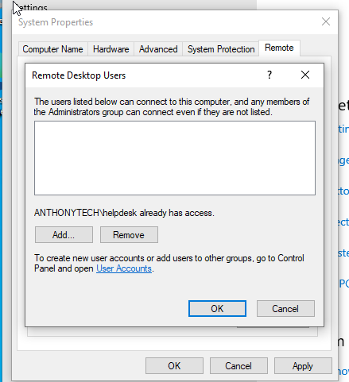
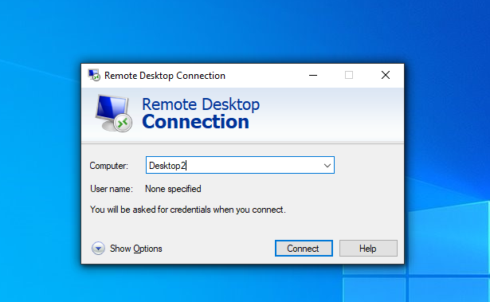
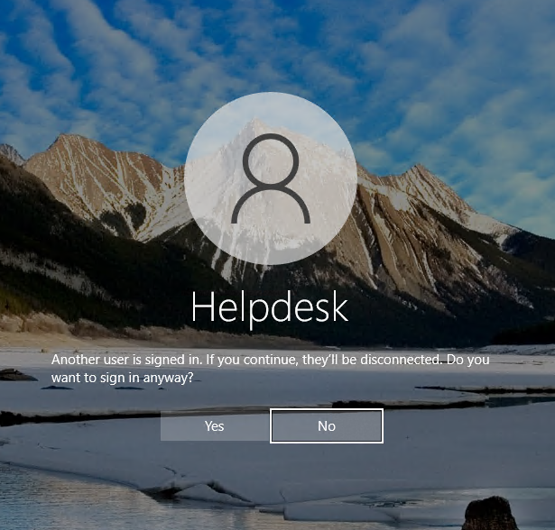
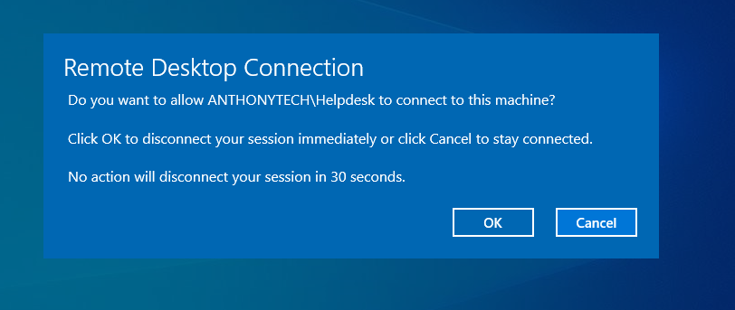
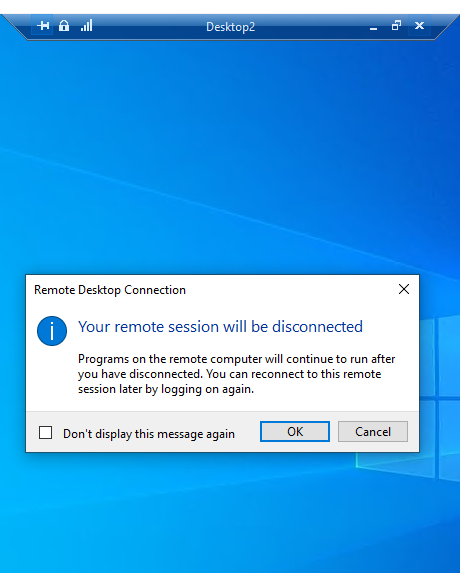

# Part 3: Troubleshooting - Account Lockout and Remote Assistance

This section focuses on two essential administrative tasks in a domain environment:

1. Unlocking and resetting a locked-out user account

2. Enabling and initiating Remote Desktop connections for remote support

These steps simulate a common scenario in which an end user forgets their password, causing account lockout, and the IT Helpdesk resolves the issue remotely.

## Step 1: Simulate Account Lockout

The user Bruce Wayne attempts multiple incorrect logins, causing the account to become locked due to the domain password policy.

## Step 2: Unlock and Reset Password via Active Directory

1. Open Active Directory Users and Computers on the Helpdesk machine

2. Locate the user Bruce Wayne

3. Right-click > Properties > Account tab

4. Check the box to Unlock account

5. Optionally, go to Reset Password, enter a new temporary password

6. Ensure the box is checked for User must change password at next logon

## Step 3: User Creates New Password at Next Login

After the password reset, Bruce Wayne logs into the domain and is prompted to create a new password.

## Step 4: Enable Remote Desktop on Client Machine

On Desktop2:

  1. Open System Properties > Remote tab
  2. Enable: Allow remote connections to this computer

  3. Confirm that Helpdesk is listed under allowed remote users

## Step 5: Initiate Remote Desktop Connection

On the Helpdesk machine:

1. Open Remote Desktop Connection
2. Enter: Desktop2

3. Authenticate as the Helpdesk domain user

4. Accept prompt about connecting active helpdesk user session

5. Disconnection prompt

## To Conclude

In this final part of the lab project, we successfully:

- Simulated a common user issue (account lockout)

- Used Active Directory tools to unlock the account and enforce a password reset

- Enabled Remote Desktop on the client machine for remote support

- Connected from the Helpdesk machine to the client using Remote Desktop

This exercise reinforces essential troubleshooting workflows and remote management techniques that IT administrators use daily in a Windows Server environment.

If you want to go back to Part 1 :🔗 [← Go to Part 1: Windows Server 2022 Setup](https://github.com/anthonydiazz/Server2022)

